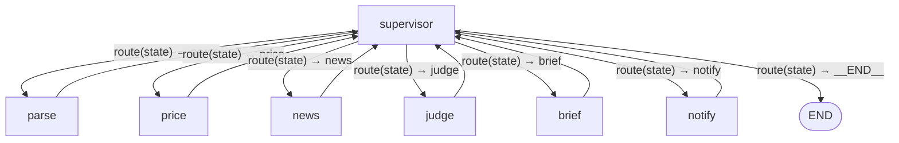

# Stock Monitor Agent 

A LangGraph-powered stock monitoring system that:
- Parses user requirements with LLMs
- Fetches live prices and news via yfinance
- Judges price movement thresholds
- Summarizes results using LLMs
- Sends notifications to Discord or console




---

## Setup

### 1. Install dependencies
```bash
pip install -r requirements.txt
```

### 2. Add your API key
Create a `.env` file in the project root:
```
OPENAI_API_KEY=sk-your-key-here
```

### 3. Configure Discord (optional)
Create a `config.yaml`:
```yaml
discord:
  webhook_url: "https://discord.com/api/webhooks/xxxx/xxxx",
    mention_id: "xxxxxxxx"
```

---

## Usage
Run the main entry:
```bash
python main.py
```

Example prompt (inside `main.py`):
```python
init = {
    "requirement": "Check MSFT and META price and tell me in discord"
}
```

---

## Project Structure
```
main.py             # LangGraph workflow definition
parser.py           # Parse natural language into structured rules
ticker_checker.py   # Fetch stock prices and compute change
news_collector.py   # Get recent headlines from yfinance
llm_interaction.py  # Interface with OpenAI models
notifier.py         # Send Discord or console notifications
```

---

## Acknowledgements
- [LangGraph](https://python.langchain.com/docs/langgraph)
- [yfinance](https://github.com/ranaroussi/yfinance)
- [OpenAI API](https://platform.openai.com)

---

## License
Apache 2.0

